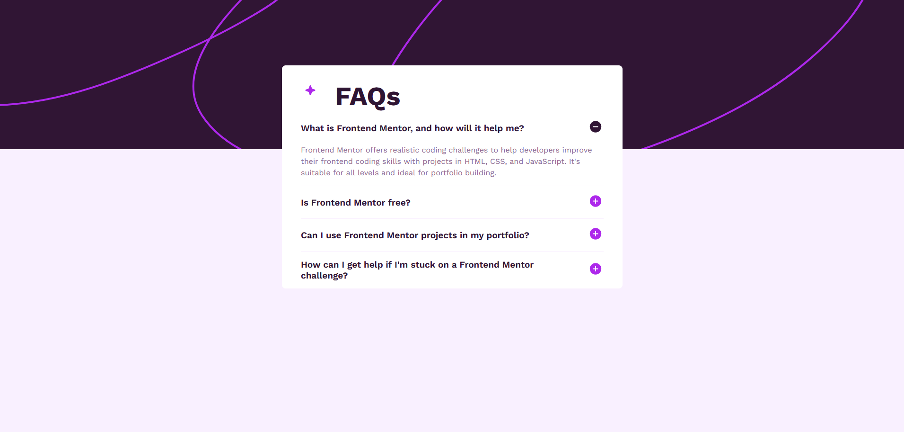
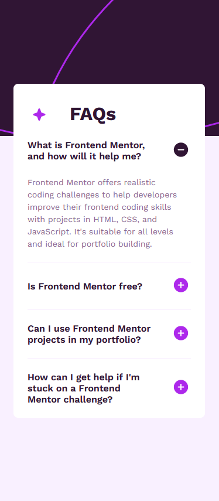

# Frontend Mentor - FAQ accordion solution

This is a solution to the [FAQ accordion challenge on Frontend Mentor](https://www.frontendmentor.io/challenges/faq-accordion-wyfFdeBwBz). Frontend Mentor challenges help me improve my coding skills by building realistic projects. 

## Table of contents

- [Overview](#overview)
  - [The challenge](#the-challenge)
  - [Screenshot](#screenshot)
  - [Links](#links)
- [My process](#my-process)
  - [Built with](#built-with)
  - [What I learned](#what-i-learned)
  - [Continued development](#continued-development)
  - [Useful resources](#useful-resources)
- [Author](#author)
- [Acknowledgments](#acknowledgments)

## Overview

### The challenge

Users should be able to:

- Hide/Show the answer to a question when the question is clicked
- Navigate the questions and hide/show answers using keyboard navigation alone
- View the optimal layout for the interface depending on their device's screen size
- See hover and focus states for all interactive elements on the page

### Screenshot

desktop view

mobile view

### Links

- Solution URL: [solution URL here](https://your-solution-url.com)
- Live Site URL: [live site URL here](https://darekrepos.github.io/FAQ-accordion/faq)

## My process

### Built with

- Semantic HTML5 markup
- CSS custom properties
- Flexbox
- CSS Grid
- Mobile-first workflow
- Eleventy
- Nunjacks temmplating engine
- Accesibility

### What I learned

I learned how to set up an Eleventy project from scratch. I improved my use of grid and flexbox, but I'd like to work on more projects to become more confident with these box layout. I also learned about accessibility best practices for decorative elements.

### Continued development

I want to create an extended project or template using Eleventy. This could be a portfolio website or a blog template. I'd like to practice more techniques for creating Eleventy layouts and components for static site builders.

In addition to accessibility, I want to ensure my code is compatible with all major browsers. I'm also interested in learning more techniques for creating non-standard elements and using CSS animations and transitions.

### Useful resources

- MDN Web Docs - this help me mostly with html and javascript part like optimizing javascript and images. 

- Sass, Eleventy Documentation - it help me with issues like mixin and deploying

- Lighthouse and Performance Insights Tool in Chrome - i use this tool to check performance and how my website behave on different screens (mobile, desktop, tablet)

- [Can I Use](https://caniuse.com) - this is excellent website that help me check if some css like text-rendering support all browsers

- [Figma](https://www.figma.com/) - Paste your design image to check the size of containers, width, etc.

## Author

- Website - [DarekRepos](https://darekrepos.github.io/)
- Frontend Mentor - [@yourusername](https://www.frontendmentor.io/profile/DarekRepos)

